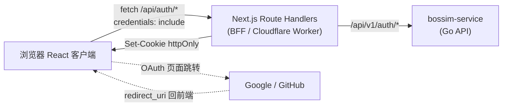
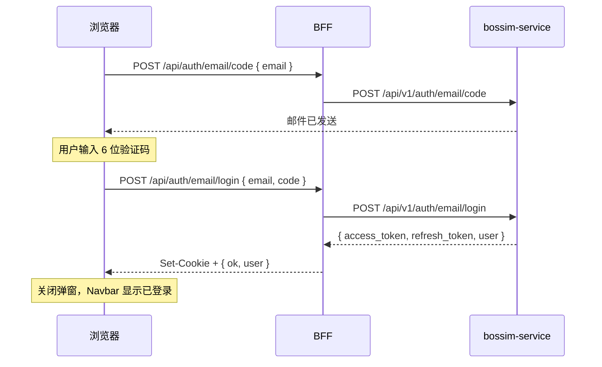
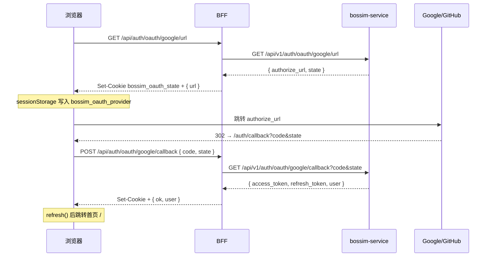
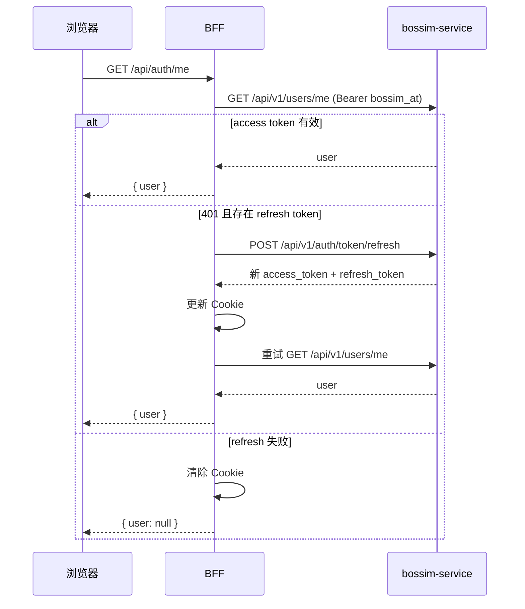
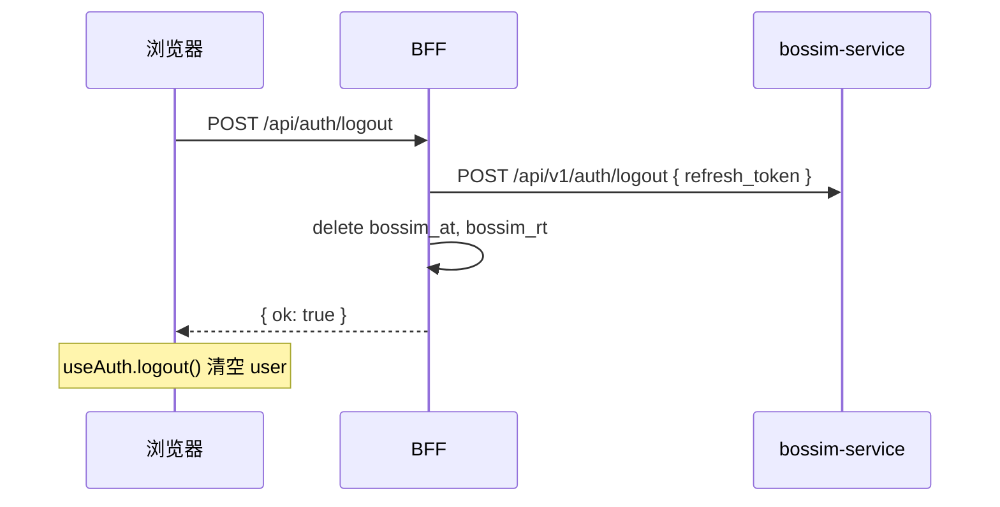

# Bossim 认证方案说明

本文档说明 Bossim 官网（`bossim-client`）的注册/登录/登出能力：设计原理、整体架构、业务流程、前后端接口约定，以及 BFF、OAuth 回调与环境配置。阅读本文后，应能独立理解「浏览器 → BFF → bossim-service」的完整认证链路。

---

## 1. 概述

Bossim 官网支持三种登录方式：

| 方式 | 说明 |
| --- | --- |
| 邮箱验证码 | 免密码；输入邮箱 → 收验证码 → 验证通过即登录/注册 |
| Google OAuth | 跳转 Google 授权，回调后完成登录 |
| GitHub OAuth | 跳转 GitHub 授权，回调后完成登录 |

技术选型要点：

- **令牌方案**：JWT Access Token + Refresh Token（由 Go 后端 `bossim-service` 签发）
- **会话存储**：Access / Refresh Token 仅存于 **httpOnly Cookie**，浏览器 JS 不可读取
- **架构模式**：**BFF（Backend for Frontend）** — 浏览器只访问 Next.js Route Handlers，由 BFF 代理 `bossim-service`
- **部署形态**：前端部署在 Cloudflare Workers（OpenNext）；后端 `bossim-service` 通过独立 API 域名对外提供服务，BFF 经 `BOSSIM_SERVICE_URL` 调用

---

## 2. 设计目标与原则

### 2.1 目标

1. 支持 Google、GitHub、邮箱验证码三种注册/登录方式
2. 采用业界标准的 JWT + Refresh Token 会话模型
3. 令牌不暴露给前端 JavaScript，降低 XSS 窃取风险
4. UI 与现有官网设计体系一致（Tailwind token、Base UI、中英文 i18n）

### 2.2 核心原则

| 原则 | 含义 |
| --- | --- |
| 浏览器不直连后端 | 所有认证请求走 `/api/auth/*`，不直接调用 `bossim-service` |
| 令牌不进 JS | `access_token` / `refresh_token` 只写入 httpOnly Cookie |
| 换码在服务端 | OAuth 的 `code` 由 BFF 转发给后端换取令牌，不在浏览器持有 client_secret |
| 配置不进仓库 | JWT 密钥、OAuth Secret、SMTP 等仅通过环境变量注入 |

---

## 3. 整体架构（BFF 模式）



### 3.1 三层职责

**浏览器（React 客户端）**

- 展示登录弹窗、邮箱 OTP、OAuth 按钮、用户菜单
- 调用同源 BFF 接口（`credentials: "include"` 自动携带 Cookie）
- 只持有**用户信息**（`user` 对象），不持有令牌
- OAuth 跳转前将 `provider` 写入 `sessionStorage`（`bossim_oauth_provider`），供回调页识别

**BFF（`app/api/auth/*` + `lib/auth/server.ts`）**

- 代理所有认证相关后端请求
- 登录成功后写入 `bossim_at` / `bossim_rt` Cookie
- 需要鉴权的请求从 Cookie 取 access token，附加 `Authorization: Bearer`
- access token 过期（401）时自动用 refresh token 续期并重试
- 登出时吊销 refresh token 并清除 Cookie

**bossim-service（Go 后端）**

- 签发/校验 JWT、管理 refresh token（含吊销）
- 发送邮箱验证码（SMTP）
- 与 Google/GitHub 完成 OAuth 授权码交换
- 提供 `GET /api/v1/users/me` 等受保护接口

### 3.2 为什么采用 BFF

若让浏览器直接调用 `bossim-service` 并自行保存 token（如 localStorage），一旦页面存在 XSS，令牌可被脚本读取。BFF 将令牌限制在 httpOnly Cookie 中，JavaScript 无法访问，是 Web 应用常见的安全实践。

---

## 4. 核心原理

### 4.1 JWT + Refresh Token

- **Access Token（JWT）**：短期有效（建议 15 分钟），用于访问受保护 API
- **Refresh Token**：长期有效（建议 30 天），仅用于换取新的 access token
- 后端使用 **HS256** 对称密钥签发 access JWT，密钥为 `BOSSIM_JWT_ACCESS_SECRET`

登录/注册/OAuth 成功后，后端返回：

```json
{
  "code": 0,
  "data": {
    "access_token": "...",
    "refresh_token": "...",
    "expires_in": 900,
    "user": { "id": "...", "email": "...", "name": "...", "avatar_url": "..." }
  },
  "message": "ok",
  "request_id": "..."
}
```

BFF 通过 `normalizeTokens()` 统一解析字段（兼容 `accessToken` / `refreshToken` 等别名），字段名差异只需改这一处。

### 4.2 Cookie 会话

| Cookie 名 | 内容 | 用途 |
| --- | --- | --- |
| `bossim_at` | Access Token | BFF 代理请求时注入 Bearer |
| `bossim_rt` | Refresh Token | 续期、登出吊销 |
| `bossim_oauth_state` | OAuth state | CSRF 二次校验（短期，约 10 分钟） |

Cookie 属性：

- `httpOnly: true` — JS 不可读
- `secure: true` — 生产环境仅 HTTPS 传输
- `sameSite: lax` — 降低 CSRF 风险，同时允许 OAuth 回调写入
- `path: /`

### 4.3 会话状态（前端 Zustand）

`lib/auth/useAuth.ts` 维护：

- `user`：当前用户对象（来自 `/api/auth/me`）
- `status`：`idle` → `loading` → `authenticated` / `unauthenticated`
- `refresh()`：拉取会话
- `logout()`：调用 BFF 登出并清空本地状态

`AuthProvider` 在应用挂载时自动执行 `refresh()`，Navbar 据此显示「登录」或用户头像菜单。

---

## 5. 认证流程

### 5.1 邮箱验证码登录



前端交互：

1. 用户输入邮箱，点击「继续」
2. BFF 代理发码；前端进入 OTP 步骤，60 秒倒计时后可重发
3. 输入 6 位验证码，可自动提交或手动点击「验证」
4. 成功后 `setUser(user)`，关闭 `AuthDialog`

### 5.2 Google / GitHub OAuth 登录

采用 **「前端承载 redirect_uri + BFF 换码」** 方案（推荐、已实现）。



**关键设计点：**

1. `redirect_uri` 指向前端页面 `{APP_ORIGIN}/auth/callback`，不是后端地址
2. Google/GitHub 把用户浏览器重定向回前端，URL 携带 `code` 和 `state`
3. 前端回调页 `/auth/callback` 将 `code` + `state` POST 给 BFF
4. BFF 用服务端请求向后端换 token，再写 httpOnly Cookie
5. **令牌不会出现在 URL 或浏览器历史记录中**

**state 双重校验：**

- 后端：生成 state 存 Redis，`/callback` 时校验
- BFF：将 state 写入 `bossim_oauth_state` Cookie，回调时与请求体中的 state 比对

**provider 识别：**

- 发起 OAuth 前，`OAuthButtons` 将 `google` / `github` 写入 `sessionStorage.bossim_oauth_provider`
- 回调页读取后调用对应 BFF 接口，用完即清除

### 5.3 会话查询与自动续期



续期逻辑封装在 `lib/auth/server.ts` 的 `authedBackend()` 中，对前端透明。

### 5.4 登出



后端吊销失败时，BFF 仍会清除本地 Cookie（best-effort 吊销）。

---

## 6. OAuth 回调与 redirect_uri 配置

### 6.1 redirect_uri 是什么

`redirect_uri` 是 OAuth 提供商（Google/GitHub）在用户授权后，**将浏览器重定向回来的地址**，并附带 `?code=...&state=...`。

- 谁被注册为 `redirect_uri`，谁的页面先收到 `code`
- 真正用 `code` + `client_secret` 换 token 的，必须是**服务端**（`bossim-service`）
- 本方案中：浏览器收到 `code` → BFF 转发给后端换 token → BFF 写 Cookie

### 6.2 推荐方案：前端承载 redirect_uri

| 对比项 | 方案 A（推荐）前端承载 | 方案 B 后端承载 |
| --- | --- | --- |
| redirect_uri | `{APP_ORIGIN}/auth/callback` | 后端 API 地址 |
| 换码方式 | 前端页 POST → BFF → 后端 JSON | 后端 302 回前端（需 ticket 机制） |
| 与当前 swagger 契合 | 是（callback 返回 JSON） | 需改后端行为 |
| 本地开发 | 简单，前后端 localhost 互通 | 需额外跨域/重定向配置 |
| 令牌安全 | 不进 URL | 需防 token 泄露到 URL |

**本项目采用方案 A。**

### 6.3 本地开发：Google 如何回调成功

Google / GitHub 对 `localhost` 有专门豁免：

- `http://localhost:3000/auth/callback` 可直接注册为 Authorized redirect URI
- 允许 `http`、允许任意端口

本地链路：

```
浏览器 localhost:3000  ←→  BFF  ←→  bossim-service localhost:8080
                              ↑
Google 回调 localhost:3000/auth/callback
```

### 6.4 生产环境部署拓扑

| 组件 | 暴露方式 | 用途 |
| --- | --- | --- |
| bossim-client | Cloudflare Workers（前端域名） | 网站 + BFF |
| bossim-service | 独立 API 域名（如 `https://api.<域名>`） | BFF 通过 `BOSSIM_SERVICE_URL` 服务端调用 |

浏览器只访问前端域名；认证、下载等需鉴权的请求均由 BFF 代理后端，**OAuth 的 `redirect_uri` 仍指向前端** `{APP_ORIGIN}/auth/callback`，不是后端 API 地址。

生产 OAuth 配置：

- Google/GitHub 控制台注册：`https://<前端域名>/auth/callback`
- 后端 `OAUTH_REDIRECT_URI`：`https://<前端域名>/auth/callback`
- 后端生成授权链接时使用的 `redirect_uri`，必须与换码时一致，否则报 `redirect_uri_mismatch`

### 6.5 多环境 redirect_uri 注册

在同一个 OAuth Client 中注册多个 Authorized redirect URI：

```
http://localhost:3000/auth/callback          # 本地
https://<生产前端域名>/auth/callback          # 生产
```

---

## 7. 接口说明

### 7.1 约定

**后端统一响应体（bossim-service）：**

```json
{
  "code": 0,
  "data": {},
  "message": "ok",
  "request_id": "uuid"
}
```

**BFF 响应体（bossim-client）：** 精简 JSON，登录成功时通过 `Set-Cookie` 写会话，响应体返回 `user`（若有）。

**浏览器请求：** 所有 BFF 请求需带 `credentials: "include"`。

---

### 7.2 BFF 接口（浏览器调用）

| 方法 | 路径 | 请求体 | 成功响应 | 说明 |
| --- | --- | --- | --- | --- |
| `POST` | `/api/auth/email/code` | `{ "email": "user@example.com" }` | `{ "ok": true }` | 发送邮箱验证码 |
| `POST` | `/api/auth/email/login` | `{ "email": "...", "code": "123456" }` | `{ "ok": true, "user": {...} }` + Set-Cookie | 验证码登录/注册 |
| `GET` | `/api/auth/oauth/{provider}/url` | — | `{ "url": "https://..." }` + Set-Cookie state | `provider`: `google` \| `github` |
| `POST` | `/api/auth/oauth/{provider}/callback` | `{ "code": "...", "state": "..." }` | `{ "ok": true, "user": {...} }` + Set-Cookie | OAuth 换码登录 |
| `GET` | `/api/auth/me` | — | `{ "user": {...} }` 或 `{ "user": null }` | 查询当前用户，含自动续期 |
| `POST` | `/api/auth/logout` | — | `{ "ok": true }` + 清除 Cookie | 登出 |

**错误响应示例：**

```json
{ "message": "login failed" }
```

HTTP 状态码：400（参数错误）、401（认证失败）、502（后端异常）。

---

### 7.3 后端接口（BFF 代理调用）

Swagger 来源：`{BOSSIM_SERVICE_URL}/swagger/doc.json`

| 方法 | 路径 | 请求 | 鉴权 | 说明 |
| --- | --- | --- | --- | --- |
| `POST` | `/api/v1/auth/email/code` | `{ "email" }` | 无 | 发送验证码邮件 |
| `POST` | `/api/v1/auth/email/login` | `{ "email", "code" }` | 无 | 验证码登录，返回令牌 |
| `GET` | `/api/v1/auth/oauth/{provider}/url` | — | 无 | 返回授权 URL 与 state |
| `GET` | `/api/v1/auth/oauth/{provider}/callback` | Query: `code`, `state` | 无 | 授权码换令牌（JSON） |
| `POST` | `/api/v1/auth/token/refresh` | `{ "refresh_token" }` | 无 | 刷新 access token |
| `POST` | `/api/v1/auth/logout` | `{ "refresh_token" }` | 无 | 吊销 refresh token |
| `GET` | `/api/v1/users/me` | — | `Authorization: Bearer` | 获取当前用户 |

---

### 7.4 接口对照表

```
浏览器                          BFF                              bossim-service
─────────────────────────────────────────────────────────────────────────────────
POST /api/auth/email/code   →   POST /api/v1/auth/email/code
POST /api/auth/email/login  →   POST /api/v1/auth/email/login
GET  /api/auth/oauth/:p/url →   GET  /api/v1/auth/oauth/:p/url
POST /api/auth/oauth/:p/cb  →   GET  /api/v1/auth/oauth/:p/callback?code&state
GET  /api/auth/me           →   GET  /api/v1/users/me (+ 可能 POST token/refresh)
POST /api/auth/logout       →   POST /api/v1/auth/logout
```

---

## 8. 环境变量与配置

### 8.1 前端 bossim-client

仅服务端使用，**不要使用 `NEXT_PUBLIC_` 前缀**。

| 变量 | 本地示例 | 生产示例 | 说明 |
| --- | --- | --- | --- |
| `BOSSIM_SERVICE_URL` | `http://localhost:8080` | `https://<后端 API 域名>` | BFF 代理后端基址（仅服务端，不暴露给浏览器 JS） |
| `APP_ORIGIN` | `http://localhost:3000` | `https://<前端域名>` | 前端公开地址（文档/回调拼接参考） |

本地开发：复制 `.env.example` 为 `.env.local`。

生产部署：在 Cloudflare Workers 中配置为 Secret / 环境变量。

### 8.2 后端 bossim-service

| 变量 | 说明 |
| --- | --- |
| `BOSSIM_JWT_ACCESS_SECRET` | HS256 签发 access JWT 的密钥，使用 `openssl rand -base64 48` 生成，**勿提交 Git** |
| `OAUTH_REDIRECT_URI` | 必须等于 `{APP_ORIGIN}/auth/callback`，并在 Google/GitHub 控制台注册 |
| `GOOGLE_OAUTH_CLIENT_ID` / `GOOGLE_OAUTH_CLIENT_SECRET` | Google OAuth 凭据 |
| `GITHUB_OAUTH_CLIENT_ID` / `GITHUB_OAUTH_CLIENT_SECRET` | GitHub OAuth 凭据 |
| `SMTP_*` | 邮箱验证码发信配置 |

### 8.3 OAuth 控制台配置清单

**Google Cloud Console → APIs & Services → Credentials → OAuth 2.0 Client**

- Application type: Web application
- Authorized redirect URIs:
  - `http://localhost:3000/auth/callback`
  - `https://<生产前端域名>/auth/callback`

**GitHub → Settings → Developer settings → OAuth Apps**

- Authorization callback URL: 同上（GitHub 可配置多个 callback URL）

### 8.4 后端 redirect_uri 一致性要求

以下三处必须完全一致：

1. Google/GitHub 控制台注册的 redirect URI
2. 后端环境变量 `OAUTH_REDIRECT_URI`
3. 后端生成授权 URL 与换码时使用的 `redirect_uri` 参数

---

## 9. 安全设计

| 措施 | 说明 |
| --- | --- |
| httpOnly Cookie | 防 XSS 窃取令牌 |
| sameSite=lax | 降低 CSRF；同源 POST 天然受保护 |
| OAuth state 双重校验 | 后端 Redis + BFF Cookie |
| 令牌不进 URL | 禁止在 redirect 中携带 access/refresh token |
| 服务端环境变量 | 后端地址、JWT 密钥不进前端 bundle |
| 发码限流 | 后端 IP + 邮箱维度限流；前端 60 秒重发节流 |
| 登出吊销 | 后端 revoke refresh token + 本地清 Cookie |

---

## 10. 代码结构

```
bossim-client/
├── app/
│   ├── api/auth/
│   │   ├── email/
│   │   │   ├── code/route.ts       # 发送验证码
│   │   │   └── login/route.ts      # 邮箱登录
│   │   ├── oauth/[provider]/
│   │   │   ├── url/route.ts        # 获取 OAuth 授权 URL
│   │   │   └── callback/route.ts   # OAuth 换码
│   │   ├── me/route.ts             # 当前用户
│   │   └── logout/route.ts         # 登出
│   └── auth/callback/page.tsx      # OAuth 浏览器落地页
├── lib/auth/
│   ├── server.ts                   # BFF 核心：Cookie、后端代理、续期
│   └── useAuth.ts                  # 客户端 Zustand 会话状态
├── components/auth/
│   ├── AuthProvider.tsx            # 挂载时 refresh 会话
│   ├── AuthDialog.tsx              # 登录弹窗
│   ├── EmailStep.tsx               # 邮箱 + OTP
│   ├── OAuthButtons.tsx            # Google / GitHub 按钮
│   ├── OAuthCallbackClient.tsx     # OAuth 回调处理
│   └── UserMenu.tsx                # 已登录用户菜单
├── .env.example                    # 环境变量模板
└── docs/auth/认证方案.md            # 本文档
```

**关键实现文件：**

- Cookie 与续期逻辑：[`lib/auth/server.ts`](../../lib/auth/server.ts)
- 客户端会话：[`lib/auth/useAuth.ts`](../../lib/auth/useAuth.ts)
- Navbar 集成：[`components/layout/Navbar.tsx`](../../components/layout/Navbar.tsx)

---

## 11. 本地开发与联调

### 11.1 启动步骤

```bash
# 1. 启动后端（默认 :8080）
# bossim-service 需配置 SMTP、OAuth、JWT 密钥

# 2. 配置前端环境变量
cp .env.example .env.local

# 3. 启动前端
pnpm install
pnpm dev
# 访问 http://localhost:3000
```

### 11.2 联调检查项

| 步骤 | 验证点 |
| --- | --- |
| 打开首页 | Navbar 显示「登录」 |
| 点击登录 | 弹出 AuthDialog（邮箱 + Google/GitHub） |
| 邮箱发码 | 收到邮件，进入 OTP 步骤 |
| 邮箱登录 | Navbar 显示头像，Cookie 中有 `bossim_at` / `bossim_rt` |
| Google 登录 | 跳转 Google → 回 `/auth/callback` → 回首页已登录 |
| 刷新页面 | 仍保持登录（`/api/auth/me` 成功） |
| 登出 | Cookie 清除，Navbar 恢复「登录」 |

### 11.3 构建验证

```bash
pnpm lint
pnpm build
```

生产部署见 [`docs/deploy.md`](../deploy.md)。

---

## 12. 常见问题

### Q1：本地 Google 回调失败，报 redirect_uri_mismatch

检查：

1. Google 控制台是否注册了 `http://localhost:3000/auth/callback`（注意端口）
2. 后端 `OAUTH_REDIRECT_URI` 是否与之一致
3. 后端生成授权 URL 时使用的 redirect_uri 是否相同

### Q2：为什么 OAuth 回调页还要 sessionStorage 存 provider？

BFF 的 `/api/auth/oauth/{provider}/callback` 路径需要知道是 Google 还是 GitHub。OAuth 提供商回调 URL 统一为 `/auth/callback`，不携带 provider 信息，因此在跳转前写入 `sessionStorage.bossim_oauth_provider`。

### Q3：前端能否直接调用 bossim-service？

当前架构**不允许**。令牌由 BFF 管理，浏览器不应持有 token，也不应暴露 `BOSSIM_SERVICE_URL` 给客户端。

### Q4：后端返回的 token 字段名不一致怎么办？

修改 `lib/auth/server.ts` 中的 `normalizeTokens()` 即可，无需改动各 Route Handler。

### Q5：access token 过期后用户会掉线吗？

不会立即掉线。BFF 在 `/api/auth/me` 或任意 `authedBackend()` 调用收到 401 时，自动用 refresh token 续期并重试。仅当 refresh token 也失效时，才会清除 Cookie 并视为未登录。

---

## 13. 相关文档

- 认证实施计划：[`.cursor/plans/auth_login_register_logout_0ebec523.plan.md`](../../.cursor/plans/auth_login_register_logout_0ebec523.plan.md)
- 环境变量模板：[`.env.example`](../../.env.example)
- 部署说明：[`docs/deploy.md`](../deploy.md)
- 后端 API：运行中的 `bossim-service` Swagger（`/swagger/doc.json`）

---

*文档版本：与 `feature-bossim-login` 分支实现同步。最后更新：2026-06-09。*
