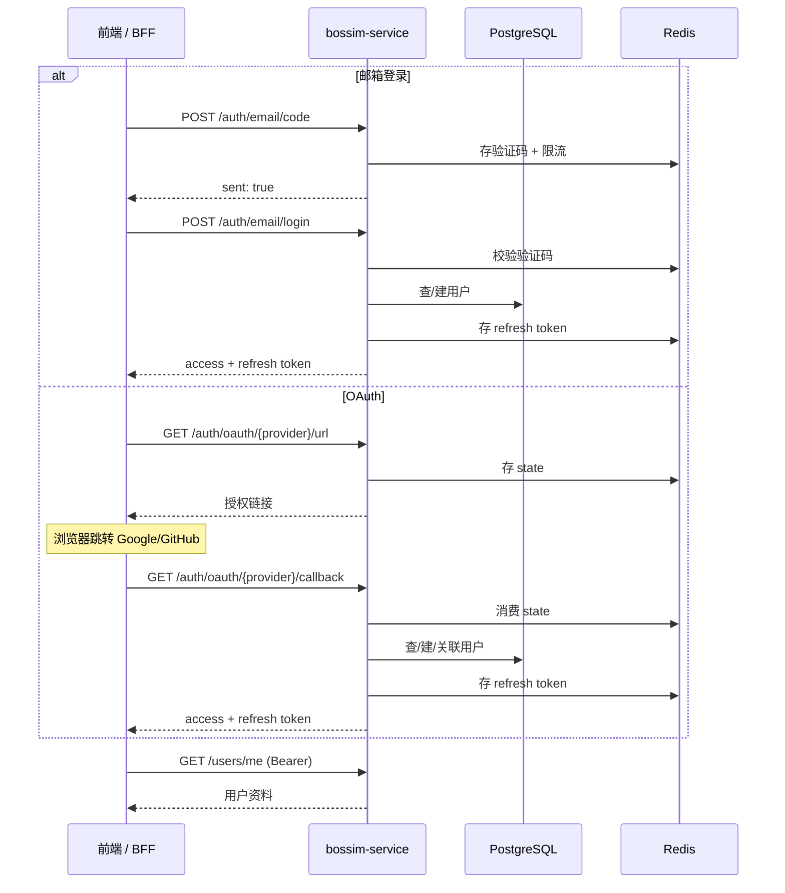
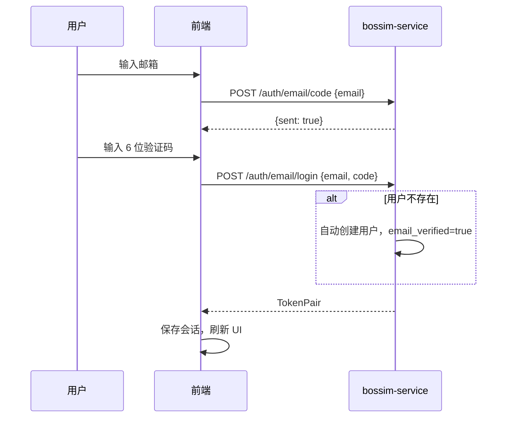
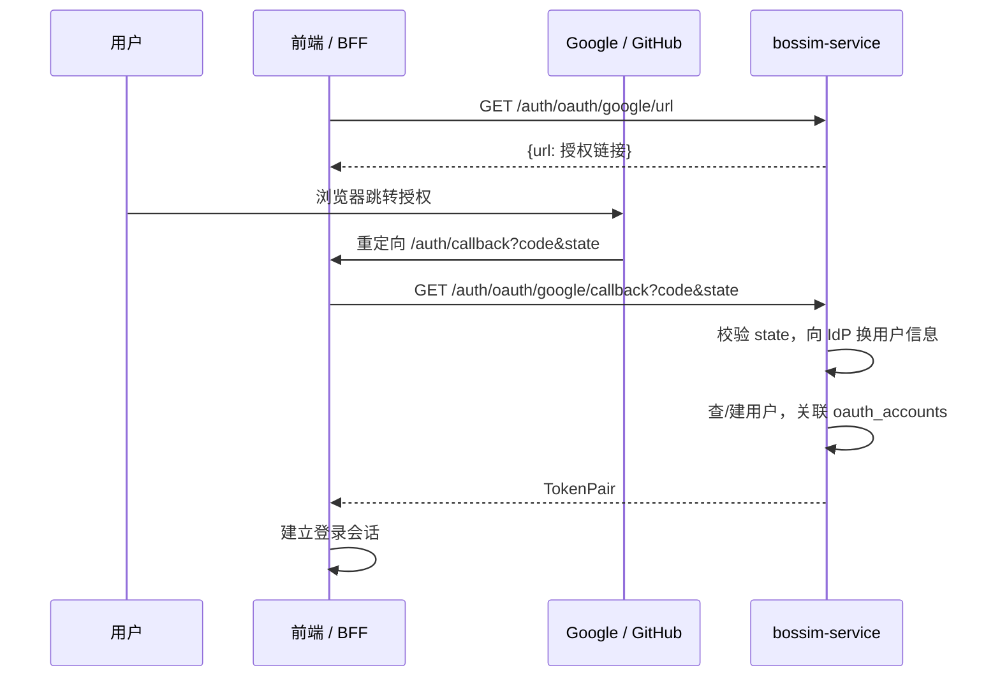

# 用户认证技术方案

- 状态：已实现
- 日期：2026-06-09
- 服务：`bossim-service`（Go / Gin）
- 消费者：Bossim 官网前端（Next.js BFF）、Bossim 桌面客户端

## 概述

认证模块提供**注册、登录、登出、会话刷新**能力，支持三种入口：

| 方式 | 说明 |
|------|------|
| 邮箱验证码 | 无独立注册接口；首次验证码登录即自动建号 |
| Google OAuth | 授权后自动建号或关联已有账号 |
| GitHub OAuth | 同上 |

会话采用 **JWT Access Token + Redis Refresh Token** 双令牌模型。Access Token 用于 API 鉴权；Refresh Token 存 Redis，支持轮换与主动吊销。

## 架构



### 核心组件

| 层级 | 职责 |
|------|------|
| `AuthHandler` | HTTP 入参校验、响应封装 |
| `AuthService` | 登录/注册/OAuth/刷新/登出编排 |
| `jwt.Manager` | Access Token 签发与校验（HS256） |
| `TokenStore` (Redis) | Refresh Token 存储、轮换、吊销 |
| `VerificationStore` (Redis) | 邮箱验证码、重发间隔、尝试次数 |
| `StateStore` (Redis) | OAuth CSRF state（一次性，TTL 10min） |
| PostgreSQL | `users`、`oauth_accounts` 持久化 |

## 令牌模型

### Access Token（JWT）

- 算法：HS256
- 默认有效期：15 分钟（`jwt.access_ttl`）
- Payload：`uid`（用户 ID）、`jti`、`iss`、`sub`、`iat`、`exp`
- 传递方式：`Authorization: Bearer <access_token>`
- 校验：`middleware.Auth` 解析后写入 `user_id` 上下文

### Refresh Token

- 格式：64 字符随机 hex（32 字节）
- 存储：Redis `refresh:{token}` → `user_id`，默认 TTL 720h
- **轮换**：每次 `POST /auth/token/refresh` 消费旧 token 并签发新 token 对
- **吊销**：`POST /auth/logout` 删除 Redis 中的 refresh token

### 登录成功响应

```json
{
  "code": 0,
  "message": "ok",
  "data": {
    "access_token": "eyJ...",
    "refresh_token": "a1b2c3...",
    "expires_at": "2026-06-09T15:30:00Z"
  }
}
```

## 登录流程

### 1. 邮箱验证码（注册 + 登录合一）



**约束**（Redis 侧）：

- 验证码 6 位数字，TTL 5 分钟
- 重发间隔 60 秒（过快返回 429）
- 最多 5 次错误尝试（超出返回 429）
- 验证成功后验证码立即销毁

本地开发未配置 AWS SES 时，验证码输出到服务端日志（`LogMailer`）。

### 2. OAuth（前端 BFF 回调模式）

OAuth 回调地址指向**前端**，而非本后端。Google/GitHub 授权完成后由前端 BFF 服务端携带 `code`、`state` 调用后端换 token。



**账号关联规则**：

1. 按 `(provider, provider_user_id)` 查找已有 OAuth 绑定 → 直接登录
2. 未绑定但 OAuth 返回 email 且库中已有同邮箱用户 → 关联到该用户
3. 否则创建新用户，写入 `oauth_accounts`

`redirect_uri` 由 `BOSSIM_OAUTH_REDIRECT_URI` 配置，须与 Google/GitHub 控制台**完全一致**（默认 `http://localhost:3000/auth/callback`）。

### 3. 登出

```
POST /api/v1/auth/logout
{ "refresh_token": "..." }
→ { "logout": true }
```

仅吊销 Refresh Token。已签发的 Access Token 在过期前仍有效（短 TTL 15min，可接受）。

### 4. 刷新会话

```
POST /api/v1/auth/token/refresh
{ "refresh_token": "..." }
→ 新的 TokenPair（旧 refresh token 立即失效）
```

前端应在 Access Token 临近过期或收到 401 时静默刷新；刷新失败则引导重新登录。

## 接口文档

统一响应信封：

```json
{
  "code": 0,
  "message": "ok",
  "data": { },
  "request_id": "uuid"
}
```

错误时 `code` 为非零业务码，`message` 为可读说明。`data` 省略。

### 认证接口（无需 Bearer）

| 方法 | 路径 | 说明 |
|------|------|------|
| `POST` | `/api/v1/auth/email/code` | 发送邮箱验证码 |
| `POST` | `/api/v1/auth/email/login` | 验证码登录（自动注册） |
| `GET` | `/api/v1/auth/oauth/{provider}/url` | 获取 OAuth 授权链接，`provider`: `google` / `github` |
| `GET` | `/api/v1/auth/oauth/{provider}/callback` | 用 `code` + `state` 换 token（**BFF 服务端调用**） |
| `POST` | `/api/v1/auth/token/refresh` | 刷新 token |
| `POST` | `/api/v1/auth/logout` | 登出 |

#### POST `/api/v1/auth/email/code`

请求：

```json
{ "email": "user@example.com" }
```

成功：`{ "sent": true }`

#### POST `/api/v1/auth/email/login`

请求：

```json
{ "email": "user@example.com", "code": "123456" }
```

成功：TokenPair（见上文）

#### GET `/api/v1/auth/oauth/{provider}/url`

成功：

```json
{ "url": "https://accounts.google.com/o/oauth2/v2/auth?..." }
```

#### GET `/api/v1/auth/oauth/{provider}/callback`

Query：`code`、`state`

成功：TokenPair

#### POST `/api/v1/auth/token/refresh`

请求：

```json
{ "refresh_token": "..." }
```

成功：TokenPair

#### POST `/api/v1/auth/logout`

请求：

```json
{ "refresh_token": "..." }
```

成功：`{ "logout": true }`

### 用户接口（需 Bearer）

| 方法 | 路径 | 说明 |
|------|------|------|
| `GET` | `/api/v1/users/me` | 获取当前登录用户 |

成功：

```json
{
  "id": "uuid",
  "email": "user@example.com",
  "email_verified": true,
  "display_name": "",
  "avatar_url": ""
}
```

### 常见错误码

| HTTP | code | 场景 |
|------|------|------|
| 400 | 90001 | 参数校验失败 |
| 400 | 10003 | 验证码错误或已过期 |
| 400 | 10008 | OAuth state 无效或换 token 失败 |
| 401 | 90002 | 缺少 Bearer token |
| 401 | 10006 | Access / Refresh token 无效 |
| 404 | 90004 | 用户不存在 |
| 429 | 10004 | 验证码重发过快 |
| 429 | 10005 | 验证码尝试次数过多 |
| 500 | 90005 | 服务端内部错误 |

完整定义见 [`internal/pkg/response/errors.go`](../../internal/pkg/response/errors.go)。

## 与前端的交互约定

### 职责划分

| 角色 | 职责 |
|------|------|
| **bossim-service** | 签发/校验 token、用户数据、OAuth 与 IdP 通信 |
| **前端 BFF**（Next.js Route Handler） | 持有 refresh token（HttpOnly Cookie）、代理后端 API、OAuth callback 换 token |
| **前端客户端** | 展示登录 UI、管理 access token 内存态、调用 BFF 或直连后端 |

### 推荐前端流程

**邮箱登录**

1. 用户提交邮箱 → BFF/前端调 `POST /auth/email/code`
2. 用户提交验证码 → 调 `POST /auth/email/login` 获 TokenPair
3. BFF 将 `refresh_token` 写入 HttpOnly Cookie；`access_token` 返回客户端或存内存
4. 调 `GET /users/me` 拉取用户资料，更新全局 Auth 状态

**OAuth 登录**

1. 调 `GET /auth/oauth/{provider}/url` 获授权链接 → `window.location` 跳转
2. IdP 回调前端 `/auth/callback?code&state`
3. 前端 BFF 服务端调 `GET /auth/oauth/{provider}/callback` 换 TokenPair
4. 同邮箱登录，建立会话

**会话维持**

- 受保护请求携带 `Authorization: Bearer <access_token>`
- Access Token 过期 → BFF 用 Cookie 中的 refresh token 调 `POST /auth/token/refresh` → 更新 token
- 用户点击登出 → 调 `POST /auth/logout` 并清除 Cookie / 本地状态

**未登录处理**

- 受保护接口返回 401 → 前端弹出登录对话框（`AuthDialog`）
- `status === "loading"` 期间禁用需登录的操作，避免误弹窗

### CORS

后端对浏览器请求开放 CORS（`Access-Control-Allow-Origin: *`），允许 `Authorization` 头。生产环境若前端直连后端，需确保部署域名可达；官网场景通常经 BFF 代理，浏览器不直接跨域调后端。

## 数据模型

### users

| 字段 | 说明 |
|------|------|
| `id` | UUID 主键 |
| `email` | 邮箱，唯一，可空（纯 OAuth 无邮箱时） |
| `email_verified` | 邮箱是否已验证 |
| `display_name` / `avatar_url` | 展示信息（OAuth 导入） |
| `status` | 账号状态，默认 `active` |

### oauth_accounts

| 字段 | 说明 |
|------|------|
| `user_id` | 关联 users |
| `provider` | `google` / `github` |
| `provider_user_id` | IdP 侧用户 ID |
| `(provider, provider_user_id)` | 唯一约束 |

迁移文件：[`migrations/000001_init_users.up.sql`](../../migrations/000001_init_users.up.sql)

## 配置项

| 配置键 | 环境变量 | 默认值 | 说明 |
|--------|----------|--------|------|
| `jwt.access_secret` | `BOSSIM_JWT_ACCESS_SECRET` | — | JWT 签名密钥（必填） |
| `jwt.access_ttl` | — | `15m` | Access Token 有效期 |
| `jwt.refresh_ttl` | — | `720h` | Refresh Token Redis TTL |
| `mail.verification_code_ttl` | — | `5m` | 验证码有效期 |
| `mail.verification_resend_interval` | — | `60s` | 重发间隔 |
| `mail.verification_max_attempts` | — | `5` | 最大尝试次数 |
| `oauth.redirect_uri` | `BOSSIM_OAUTH_REDIRECT_URI` | — | OAuth 回调（指向前端） |
| `oauth.google.*` | `BOSSIM_OAUTH_GOOGLE_*` | — | Google 凭证 |
| `oauth.github.*` | `BOSSIM_OAUTH_GITHUB_*` | — | GitHub 凭证 |

## 安全要点

- **无密码体系**：邮箱通道依赖验证码 + 发送/校验限流；OAuth 依赖 IdP
- **Refresh Token 轮换**：每次刷新旧 token 立即失效，降低泄露影响
- **OAuth CSRF**：`state` 一次性存储于 Redis，回调时校验并消费
- **Access Token 无状态吊销**：依赖短 TTL；登出仅吊销 refresh
- **验证码防暴力**：Redis 计数 + TTL，超限拒绝

## 相关代码

| 文件 | 说明 |
|------|------|
| [`internal/api/v1/handler/auth_handler.go`](../../internal/api/v1/handler/auth_handler.go) | HTTP 处理器 |
| [`internal/service/auth_service.go`](../../internal/service/auth_service.go) | 业务逻辑 |
| [`internal/middleware/auth.go`](../../internal/middleware/auth.go) | Bearer 鉴权中间件 |
| [`internal/server/router.go`](../../internal/server/router.go) | 路由注册 |

Swagger 文档：非生产环境访问 `/swagger/index.html`，或导入 `api/docs/swagger.json`。
