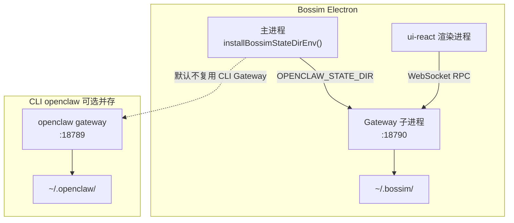

# Bossim 工作空间隔离方案（`~/.bossim`）

本文说明 Bossim 桌面端为何从共享的 `~/.openclaw/` 迁到独立的 `~/.bossim/`，以及迁移、端口、开发联调与 UI 路径的完整处理方式。实现分布在 `apps/electron/`、`ui-react/` 与 OpenClaw core（通过 `OPENCLAW_STATE_DIR` 继承，core 本身无需感知 Bossim 品牌）。

---

## 1. 背景

### 1.1 原先的问题

Bossim（Electron 桌面客户端）与 CLI `openclaw` 历史上共用同一套本机状态目录：

| 共用资源 | 路径（旧） |
|----------|------------|
| 主配置 | `~/.openclaw/openclaw.json` |
| Agent / 凭证 / 工作区 | `~/.openclaw/agents/`、`credentials/`、`workspace/` |
| Gateway 默认端口 | **18789** |
| Gateway 进程锁 | `/tmp/openclaw-openclaw-<uid>/` |
| Bossim 账号会话 | `~/.openclaw/bossim-auth.json` |

带来的问题：

1. **同机无法安全并存**：开发者或用户同时装 Bossim App 与 CLI 时，会争用配置、凭证、Gateway 锁与端口。
2. **升级与调试互相污染**：Electron dev 可能复用 CLI 已启动的 Gateway，读写仍落在 `~/.openclaw/`。
3. **产品边界不清**：Bossim 是独立桌面产品，但磁盘布局与 CLI 完全一致，不利于独立演进与发布。

### 1.2 目标

- Bossim 默认使用 **`~/.bossim/`** 作为状态根目录。
- CLI `openclaw` 继续使用 **`~/.openclaw/`**，互不覆盖。
- Gateway 默认端口错开：**Bossim 18790**，**CLI 18789**。
- 已有 CLI 用户**首次启动 Bossim** 时，自动白名单迁移必要数据，**不删除、不修改** `~/.openclaw/`。
- 保留 **Escape hatch**（`BOSSIM_USE_OPENCLAW_STATE=1`）供本地联调 CLI Gateway。

---

## 2. 方案总览



### 2.1 对比表

| 项目 | Bossim（默认） | CLI `openclaw` |
|------|----------------|----------------|
| State 根目录 | `~/.bossim/` | `~/.openclaw/` |
| 主配置文件 | `~/.bossim/openclaw.json` | `~/.openclaw/openclaw.json` |
| Gateway HTTP + WebSocket | `http://127.0.0.1:18790` / `ws://127.0.0.1:18790` | `127.0.0.1:18789` |
| Tmp lock 目录 | `/tmp/openclaw-bossim-<uid>/` | `/tmp/openclaw-openclaw-<uid>/` |
| Bossim 账号会话 | `~/.bossim/bossim-auth.json` | （CLI 不读此文件；旧数据可能在 `~/.openclaw/bossim-auth.json`） |
| Electron 主进程日志 | `~/.bossim/logs/electron-main.log` | — |

> **说明**：`18790` 是 **Gateway 服务端口**（同时提供 HTTP Control UI 与 WebSocket），不是 Setup 向导或 Vite dev 的端口。Setup / 主 UI 在 dev 下走 `http://localhost:5174`。

---

## 3. 核心机制

### 3.1 状态目录解析（`bossim-state.ts`）

解析顺序（`apps/electron/src/main/bossim-state.ts`）：

1. `BOSSIM_USE_OPENCLAW_STATE=1` → `~/.openclaw`（联调 escape hatch）
2. `BOSSIM_STATE_DIR` → 自定义绝对/相对路径
3. 默认 → `~/.bossim`

主进程在 `app.whenReady()` **之前** 调用 `installBossimStateDirEnv()`，将结果写入 `process.env.OPENCLAW_STATE_DIR`。此后：

- Electron 主进程内所有派生路径读 `BOSSIM_STATE_DIR`；
- **spawn 出的 Gateway 子进程**继承该环境变量，core 的 `resolveStateDir()`（`src/config/paths.ts`）自动落到 `.bossim`，**无需改 core 业务代码**。

### 3.2 首次启动迁移（`state-migration.ts`）

**触发条件**（同时满足）：

- 未设置 `BOSSIM_USE_OPENCLAW_STATE=1`
- `~/.bossim/` 尚不存在
- `~/.openclaw/` 存在

**行为**：从 `~/.openclaw/` **选择性复制**白名单到 `~/.bossim/`，源目录**原样保留**。

**白名单（文件 / 目录）**：

| 类型 | 条目 |
|------|------|
| 配置与备份 | `openclaw.json`、`openclaw.json.last-good`、`openclaw.json.bak.*`、`gateway-instance-id`、`exec-approvals.json`、`update-check.json` |
| 账号 | `bossim-auth.json` |
| 业务数据 | `agents/`、`credentials/`、`workspace/`、`skills/`、`plugin-skills/`、`identity/`、`devices/`、`service-env/`、`memory/`、`flows/`、`tasks/`、`cron/`、`delivery-queue/`、`session-delivery-queue/` |
| 插件 | 仅 `plugins/installs.json`（不复制 plugins 缓存） |

**刻意不复制**（留在 CLI 侧或可再生）：`logs/`、`media/`、`npm/`、`canvas/`、`feishu/dedup/`、plugins 缓存等。

**迁移后改写 `~/.bossim/openclaw.json`**：

- `gateway.port`：若仍为 CLI 默认 `18789` → 改为 **18790**
- `gateway.controlUi.allowedOrigins`：删除（由 Electron 启动时重建）
- `agents.defaults.workspace`：`~/.openclaw/workspace` → `~/.bossim/workspace`

**标记文件**：`~/.bossim/.migrated-from-openclaw`（幂等，避免重复全量复制）。

### 3.3 Bossim 账号会话迁移（`bossim-auth.ts`）

除白名单复制外，覆盖「workspace 已迁、auth 仍在旧路径」的中间态：

- 条件：非 escape hatch、新路径 `~/.bossim/bossim-auth.json` 不存在、旧路径 `~/.openclaw/bossim-auth.json` 存在
- 动作：`copyFileSync` 到新路径（**不删除**旧文件）
- 时机：`readStoreFile()` 首次读会话前（幂等）

### 3.4 Gateway 锁隔离

`src/config/paths.ts` 的 `resolveGatewayLockDir()` 按 `basename(OPENCLAW_STATE_DIR)` 派生后缀，Bossim 与 CLI 的 lock 文件天然分离，可同时 spawn 两个 Gateway。

### 3.5 Dev 模式默认不复用 CLI Gateway

`canReuseExistingGateway()` 在 dev 下默认 **false**（除非 `BOSSIM_USE_OPENCLAW_STATE=1`），避免 Electron dev 误连 `18789` 上的 CLI Gateway 并污染 `~/.openclaw/`。

---

## 4. 目录结构与 Session 存放位置

Bossim 聊天、配置、定时任务等均通过 **Bossim Gateway（18790）** 的 RPC 读写 `~/.bossim/`，UI 不硬编码磁盘路径。

### 4.1 常用路径

| 用途 | 路径 |
|------|------|
| 主配置 | `~/.bossim/openclaw.json` |
| 默认 Agent 工作区 | `~/.bossim/workspace/` |
| 全局 managed skills | `~/.bossim/skills/` |
| Session 索引 | `~/.bossim/agents/<agentId>/sessions/sessions.json` |
| **对话 transcript（全文）** | `~/.bossim/agents/<agentId>/sessions/<sessionId>.jsonl` |
| 运行轨迹（可选） | `~/.bossim/agents/<agentId>/sessions/<sessionId>.trajectory.jsonl` |
| 渠道凭证 | `~/.bossim/credentials/` |
| 定时任务 | `~/.bossim/cron/` |
| Bossim 登录会话 | `~/.bossim/bossim-auth.json` |

默认 agent 为 `main`，因此主会话目录一般为：

```text
~/.bossim/agents/main/sessions/
├── sessions.json          # session 列表元数据
├── <uuid>.jsonl           # 单会话对话记录
└── <uuid>.trajectory.jsonl
```

验证某条用户消息是否写入 Bossim 侧：

```bash
rg -n "你的消息关键词" ~/.bossim/agents/main/sessions/*.jsonl
```

若命中在 `~/.openclaw/agents/...` 而非 `~/.bossim/...`，说明当前 UI 连的是 **CLI Gateway（18789）**，而非 Bossim Gateway（18790）。

### 4.2 与 CLI 并存时的数据归属

| 操作入口 | 预期写入目录 |
|----------|--------------|
| Bossim Electron / 连 `ws://127.0.0.1:18790` | `~/.bossim/` |
| `pnpm openclaw gateway`（18789） | `~/.openclaw/` |

飞书、微信、cron、`config.set` 等**无需改插件代码**：均走 Gateway + `OPENCLAW_STATE_DIR`。注意同一渠道 WebSocket 连接通常不能双开，Bossim 启动后可能接管渠道连接。

---

## 5. UI 与开发环境改动

### 5.1 动态路径层（`ui-react`）

避免 UI 硬编码 `~/.openclaw`：

| 模块 | 说明 |
|------|------|
| `ui-react/src/lib/bossim-paths.ts` | `resolveBossimPaths()`、`hydrateWizardBossimDefaults()` |
| `ui-react/src/hooks/use-bossim-paths.ts` | React hook |
| IPC `bossim:state-dir` | 主进程返回 `stateDir`、`defaultAgentWorkspace`、`managedSkillsDir`、`defaultGatewayPort` |
| `AgentsPage` | 新建 agent 的 workspace 用 IPC 路径 |
| `WizardContainer` | 启动时 hydrate workspace / gatewayPort |

纯浏览器 dev 无 Electron 时 fallback：`~/.bossim`、`~/.bossim/workspace`、端口 `18790`。

### 5.2 Gateway URL / 端口（dev 刷新修复）

| 文件 | 改动要点 |
|------|----------|
| `ui-react/src/store/settings.store.ts` | Electron+Vite 刷新时优先读 `localStorage` 中 persisted gateway URL；默认端口 18790 |
| `ui-react/vite.config.ts` | `VITE_GATEWAY_PORT` 默认 **18790** |
| `apps/electron/package.json` `dev` | 向 Vite 与 Electron 注入 `VITE_GATEWAY_PORT=18790` |
| `ui-react/vite-dev-device-pairing-plugin.ts` | 读 `~/.bossim/openclaw.json`（与 bossim-state 规则一致） |

### 5.3 Setup Wizard

- `setup-wizard.store.ts` 默认 `gatewayPort: 18790`、`workspace: ~/.bossim/workspace`
- 向导挂载时通过 `hydrateWizardBossimDefaults()` 与主进程 IPC 对齐

### 5.4 本地开发模式一览

| 模式 | 命令 | State | Gateway | UI |
|------|------|-------|---------|-----|
| **推荐** Electron + HMR | `pnpm electron:dev` | `~/.bossim` | spawn **18790** | `http://localhost:5174` |
| 纯浏览器 Vite | `pnpm ui:react:dev` | 读 `~/.bossim/openclaw.json` | 需自行起 Gateway；配 `VITE_GATEWAY_TOKEN` | `http://localhost:5174` |
| 联调 CLI | `BOSSIM_USE_OPENCLAW_STATE=1 pnpm electron:dev` | `~/.openclaw` | 复用 **18789** | 同左 |
| CLI 独立 | `pnpm openclaw gateway` | `~/.openclaw` | **18789** | — |

浏览器 dev 入口：

- 主界面：`http://localhost:5174/`
- Setup mock：`http://localhost:5174/setup-mock.html`

Bossim 账号登录需 **Electron**（`bossim://` 协议回调）；纯浏览器可用 `VITE_SKIP_AUTH=1` 或 dev mock（见 [bossim-auth-guide.md](./auth/bossim-auth-guide.md)）。

详细联调步骤见 [dev/electron-local-dev.md](./dev/electron-local-dev.md)。

---

## 6. 环境变量

| 变量 | 作用 |
|------|------|
| `BOSSIM_STATE_DIR` | 覆盖 Bossim 状态根目录 |
| `BOSSIM_USE_OPENCLAW_STATE=1` | 退回 `~/.openclaw`，dev 可复用 CLI Gateway |
| `OPENCLAW_STATE_DIR` | 由主进程注入；子 Gateway 继承 |
| `OPENCLAW_CONFIG_DIR` | 覆盖配置目录（auth 存储等亦尊重此变量） |
| `VITE_GATEWAY_PORT` | ui-react dev 默认 Gateway 端口（Bossim：**18790**） |
| `VITE_GATEWAY_TOKEN` | 浏览器 dev 直连 Gateway 的 token |
| `VITE_SKIP_AUTH=1` | 跳过 AuthGate（仅 UI 开发） |
| `BOSSIM_BFF_URL` / `BOSSIM_AUTH_APP_URL` | Electron dev 登录联调（见 `apps/electron/.env.example`） |

---

## 7. 验证清单

### 7.1 端口与进程

```bash
lsof -nP -iTCP:5174 -sTCP:LISTEN   # Vite
lsof -nP -iTCP:18790 -sTCP:LISTEN  # Bossim Gateway
lsof -nP -iTCP:18789 -sTCP:LISTEN  # CLI Gateway（若单独启动）
```

### 7.2 目录与配置

```bash
ls -la ~/.bossim/.migrated-from-openclaw   # 迁移标记（若从 CLI 迁过）
cat ~/.bossim/openclaw.json | rg '"port"'   # 应为 18790（除非手动改过）
```

### 7.3 聊天 session 落盘

```bash
ls -lt ~/.bossim/agents/main/sessions/*.jsonl | head
rg -n "测试消息" ~/.bossim/agents/main/sessions/*.jsonl
```

### 7.4 Electron dev 刷新

1. `pnpm electron:dev` → 连 `ws://127.0.0.1:18790`
2. DevTools 刷新后仍连 **18790**（非 18789）

### 7.5 Auth

- Electron 登录后：`~/.bossim/bossim-auth.json` 应存在（或 lazy 从 `~/.openclaw/` 复制）

---

## 8. 常见问题

### Q1：`http://127.0.0.1:18790` 打开的是 OpenClaw Gateway Dashboard，不是 Bossim UI？

正常。18790 是 **Gateway 内置 Control UI**（HTTP + WS 同端口）。Bossim 定制主界面在 Electron 窗口或 `localhost:5174`。

### Q2：浏览器 `localhost:5174` 登录后刷新又要登录？

纯浏览器 dev 的 auth mock **不持久化**到磁盘；真实登录需 Electron，或设置 `VITE_SKIP_AUTH=1`。见 [bossim-auth-guide.md](./auth/bossim-auth-guide.md) §7.2。

### Q3：消息写在 `~/.openclaw` 而不是 `~/.bossim`？

检查 UI 连接的 Gateway URL 是否为 `ws://127.0.0.1:18790`；若连 18789 则写入 CLI 状态目录。

### Q4：能否删 `~/.openclaw/`？

**不要**在仍需 CLI 时删除。Bossim 迁移是**复制**，CLI 目录应保持独立可用。

### Q5：Escape hatch 何时用？

本地需要 Bossim UI 但共用 CLI 已配置的 Gateway / `~/.openclaw` 时：

```bash
BOSSIM_USE_OPENCLAW_STATE=1 pnpm electron:dev
```

---

## 9. 相关代码与文档

### 9.1 代码入口

| 路径 | 职责 |
|------|------|
| `apps/electron/src/main/bossim-state.ts` | 状态目录解析与 env 注入 |
| `apps/electron/src/main/state-migration.ts` | 首次启动白名单迁移 |
| `apps/electron/src/main/bossim-auth.ts` | 账号会话路径与 lazy 迁移 |
| `apps/electron/src/main/gateway/constants.ts` | `DEFAULT_GATEWAY_PORT_BOSSIM = 18790` |
| `apps/electron/src/main/index.ts` | IPC `bossim:state-dir` |
| `src/config/paths.ts` | `resolveStateDir()`、`resolveGatewayLockDir()` |
| `src/config/sessions/paths.ts` | Session transcript 路径 |
| `ui-react/src/lib/bossim-paths.ts` | UI 动态路径 |

### 9.2 文档交叉引用

| 文档 | 内容 |
|------|------|
| [dev/electron-local-dev.md](./dev/electron-local-dev.md) | 本地开发三种模式、env、pairing |
| [setup_wizard.md](./setup_wizard.md) | 安装向导与工作空间说明 |
| [auth/bossim-auth-guide.md](./auth/bossim-auth-guide.md) | Bossim 账号登录与存储 |
| [apps/electron/docs/gateway-lifecycle.md](../../apps/electron/docs/gateway-lifecycle.md) | Gateway spawn / stop / 隔离细节 |
| [chat/gateway-integration.md](./chat/gateway-integration.md) | UI 与 Gateway WebSocket |

### 9.3 测试

```bash
node scripts/run-vitest.mjs test/electron/bossim-state.test.ts test/electron/state-migration.test.ts test/electron/bossim-auth.test.ts
cd ui-react && npx vitest run src/store/settings.store.test.ts
```

---

## 10. 变更摘要（发布说明用）

- Bossim/Electron 默认工作空间迁至 `~/.bossim/`，与 CLI `~/.openclaw/` 隔离。
- Gateway 默认端口 **18790**（CLI 保持 **18789**）；tmp lock 按 state dir 后缀隔离。
- 首次启动从 `~/.openclaw/` 白名单迁移；改写 port / workspace；不修改 CLI 目录。
- `bossim-auth.json` 迁至 `~/.bossim/`；支持从旧路径 lazy 复制。
- ui-react 动态路径、dev 默认端口与 Electron 刷新恢复 Gateway URL 已对齐 Bossim 默认值。
- Escape hatch：`BOSSIM_USE_OPENCLAW_STATE=1` 恢复 legacy `~/.openclaw` 行为。
