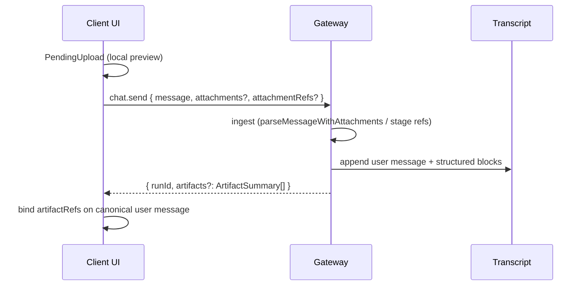
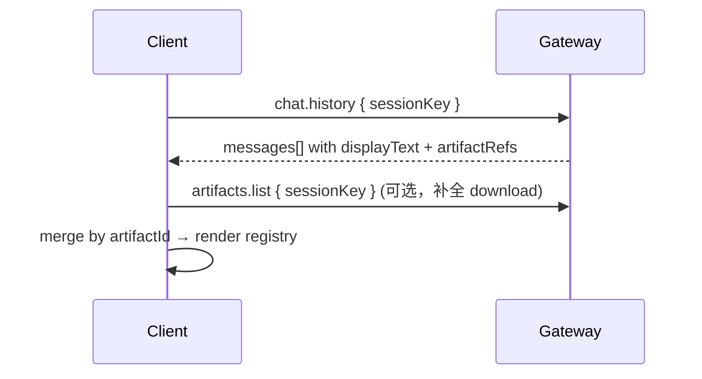

# Chat Artifacts 协议化设计（草案）

> **状态**：草案，可行落地路径；暂不绑定 `PROTOCOL_VERSION` 升级。  
> **受众**：Gateway、`ui-react`、Control UI (`ui/`)、SDK / 第三方客户端。  
> **相关**：`src/gateway/protocol/schema/artifacts.ts`、`docs/gateway/protocol.md`、`ui-react/docs/attachment/attachment-upgrade-proposal.md`

## 1. 背景与问题

当前「文件 / 媒体」在 chat 路径上至少存在五套并行概念：

| 概念 | 位置 | 职责 |
|------|------|------|
| `chat.send.attachments` | WS RPC | base64 ingest（主要为图片） |
| `chat.send.attachmentRefs` | WS RPC | Electron 本地路径引用（文档/音频等） |
| `MessageAttachment` / history hints | ui-react | 气泡展示（无稳定 id） |
| 正文附录 `以下是上传文件的内容：` | Gateway prompt + UI strip | 历史兼容、Agent 读路径 |
| `ArtifactSummary` + `artifacts.*` | 已有协议 | transcript **事后**索引与下载 |

结果是：发送、展示、持久化、下载各用各的形状；用户文档 refs 往往进不了 `artifacts.list`；前端靠字符串剥附录维持展示。

**目标**：以 Gateway TypeBox schema 为单一真相，统一 **持久化后的资源身份** 与 **消息绑定**；发送 ingest 与 Composer 本地状态保留专用 DTO，但不另起一套长期并行的「附件类型」。

## 2. 设计原则

1. **协议优先**：持久化与读路径的类型定义在 `src/gateway/protocol/schema/`，经 `pnpm protocol:gen` 生成共享产物；客户端禁止长期维护平行的 hand-written 摘要类型。
2. **分层，不合一**：Ingest（写）、Persisted（存）、Binding（挂消息）、Download（取字节）分开建模。
3. **Additive 演进**：新字段、新方法优先；旧 `attachments` / `attachmentRefs` / 正文附录在兼容窗口内保留。
4. **安全默认**：`artifacts.download` 不代拉本地 path / 任意 URL；与现有 `collectArtifactsFromMessages` 行为一致。
5. **能力协商**：Web / Electron / 节点客户端通过 ingest channel 声明能发什么，不靠 UI 猜。

## 3. 术语

| 术语 | 含义 |
|------|------|
| **Artifact** | 一次 ingest 后在 Gateway 侧可寻址的持久化资源（有稳定 `artifactId`）。 |
| **ArtifactSummary** | 已有 wire 类型：资源的只读摘要 + `download.mode`。 |
| **ArtifactRef** | 消息上的轻量引用：`{ artifactId, role? }`，不含字节。 |
| **IngestEnvelope** | `chat.send` 上的写入载荷（base64 / path ref / 未来 upload session）。 |
| **PendingUpload** | 客户端本地、尚未获得 `artifactId` 的 Composer 状态（**不**上 wire）。 |

`ArtifactSummary` **复用**现有 schema（`src/gateway/protocol/schema/artifacts.ts`），必要时 **扩展字段**，不新建 `ChatAttachment2`。

## 4. 目标与非目标

### 4.1 目标

- 用户/助手消息上的资源，长期只通过 **`artifactId` + `ArtifactSummary`** 绑定与展示。
- `chat.history`、流式 `chat` 事件、`artifacts.list` 对同一资源描述一致。
- 按 `type`（`image` | `audio` | `file`）与 `download.mode` 注册渲染器；客户端无特例字符串解析。
- Electron 文档 ingest 后也进入 artifact 索引（不再仅依赖 prompt 附录）。
- SDK 与 Control UI / ui-react 共用下载路径：`artifacts.download`。

### 4.2 非目标（本阶段）

- 不合并 tool 输出文件、compaction checkpoint、doctor repair 进本设计（可后续扩展 `source`）。
- 不改变 Agent 内部 `media://` store 实现；对外只暴露 `artifactId` 或受控 download。
- 不要求 `PROTOCOL_VERSION` bump（字段与方法 additive；旧客户端可忽略新字段）。
- 不规定具体 React 组件结构（只规定 wire + canonical 字段）。

## 5. 架构分层

```text
┌─────────────────────────────────────────────────────────────────┐
│  Client (Composer)                                               │
│  PendingUpload (local File, preview)                             │
└────────────────────────────┬────────────────────────────────────┘
                             │ chat.send (IngestEnvelope[])
                             ▼
┌─────────────────────────────────────────────────────────────────┐
│  Gateway Ingest                                                  │
│  normalize → validate → store (media store / sandbox stage)      │
│  emit ArtifactSummary[]                                          │
└────────────────────────────┬────────────────────────────────────┘
                             │ persist transcript blocks + refs
                             ▼
┌─────────────────────────────────────────────────────────────────┐
│  Transcript (JSONL)                                              │
│  structured content blocks + message.artifactRefs[]              │
└────────────────────────────┬────────────────────────────────────┘
                             │ project / index
                             ▼
┌─────────────────────────────────────────────────────────────────┐
│  Read APIs                                                       │
│  chat.history (display text + artifactRefs)                      │
│  artifacts.list | get | download                                 │
│  chat stream events (optional artifact batch)                    │
└─────────────────────────────────────────────────────────────────┘
```

### 5.1 三层 DTO

| 层 | 类型 | 说明 |
|----|------|------|
| **Ingest** | `ChatSendAttachment` / `ChatSendAttachmentRef`（现有，可收紧 schema） | 仅用于 `chat.send` 请求 |
| **Persisted** | `ArtifactSummary`（扩展） | list/get/download/history 一致 |
| **Binding** | `ArtifactRef` | 消息 ↔ artifact，不含 payload |

## 6. Wire 契约（Additive 草案）

以下均为 **建议新增或收紧**；实现时可分 Phase 落地。

### 6.1 扩展 `ArtifactSummarySchema`

在现有字段上增加（均可选，旧客户端忽略）：

```typescript
// 逻辑形状（最终以 TypeBox 为准）
{
  id: string;                    // 已有：artifact_{hash}
  type: "image" | "audio" | "file";  // 已有（归一化）
  title: string;                 // 已有
  mimeType?: string;
  sizeBytes?: number;
  sessionKey?: string;
  runId?: string;
  taskId?: string;
  messageSeq?: number;
  source?: "user-upload" | "assistant-output" | "tool-output" | "offload";
  download: { mode: "bytes" | "url" | "unsupported" };

  // --- 新增（建议）---
  role?: "input" | "output";     // 相对消息的方向
  contentIndex?: number;         // 在 message.content[] 中的下标（与现有 id 哈希对齐）
  ingestChannel?: "inline-base64" | "path-ref" | "managed-image" | "transcript-block";
}
```

**`artifactId` 生成（短期）**：保持现有确定性哈希（`sessionKey + messageSeq + contentIndex + type + title`），避免破坏 `artifacts.get`。

**长期可选**：ingest 时分配 opaque id（如 `art_...`），history 只存该 id；需迁移策略，非 Phase 1。

### 6.2 新增 `ArtifactRefSchema`

```typescript
{
  artifactId: string;
  role?: "input" | "output";  // 默认 user 消息为 input
}
```

### 6.3 `chat.send` 响应扩展

现有：`{ runId, status }`

建议 **additive**：

```typescript
{
  runId: string;
  status: "started" | "in_flight";
  artifacts?: ArtifactSummary[];  // 本次 send ingest 产生的摘要
}
```

客户端用 `artifacts` 将 `PendingUpload` 映射为持久 id，更新 optimistic 消息上的 `artifactRefs`。

### 6.4 `chat.history` 消息形状收紧

`logs-chat` 中 `messages[].attachments` 现为 `Unknown[]`。

建议改为（或并行新字段）：

```typescript
{
  role: string;
  content: ...;           // display-normalized text（继续剥附录）
  artifactRefs?: ArtifactRef[];
  // 兼容期保留 attachments?: ChatHistoryAttachmentHint[]（deprecated）
}
```

Gateway 在 `projectRecentChatDisplayMessages` 或专用投影步骤：

1. `splitUserMessageForChatHistoryDisplay` → `displayText`
2. 从 transcript 块 + ingest 记录合成 `artifactRefs`
3. 不再把 path/sha256 附录放进 **display** 正文（Agent 仍可在 `BodyForAgent` 保留至 deprecate 完成）

### 6.5 `chat` 流式事件（可选，Phase 3）

在 `chat.final` / 含 media 的 delta 载荷中增加：

```typescript
artifacts?: ArtifactSummary[];
```

便于助手产出图片后 UI 无需二次 `artifacts.list` 轮询。

### 6.6 Ingest 请求（保持 + 文档化）

`ChatSendParamsSchema` 保持：

- `attachments?: unknown[]` → 规范为 `ChatSendAttachment`（`mimeType`, `fileName`, `content` base64）
- `attachmentRefs?: unknown[]` → 规范为 `ChatSendAttachmentRef`（`fileId`, `path`, `fileName`, `mimeType`, `size`, `sha256`）

新增 **可选** 能力头（或 connect 时 client capabilities）：

```typescript
clientCapabilities?: {
  attachmentIngest?: ("inline-base64" | "path-ref")[];
}
```

Gateway 在无 `path-ref` 时拒绝仅 refs 的非图片发送，错误码明确。

## 7. 生命周期

### 7.1 用户上传（send）



**按 kind 的 ingest 策略（与现实现对齐）**：

| Kind | Ingest | Persisted | Agent 消费 |
|------|--------|-----------|------------|
| image | `attachments` base64 | inline 或 `media://` offload + 可选 managed block | vision / media understanding |
| document (Electron) | `attachmentRefs` | sandbox/MediaPaths + transcript ref | file tools @ path |
| document (Web) | `attachments` base64（待接）或 upload API | offload | 只读副本 |
| audio | 同 document | 同 document | 工具 / 转写 |

Phase 1 可不改 ingest 实现，仅 **在 ack/history 回传 `ArtifactSummary`**。

### 7.2 历史加载



UI **不应**再依赖 `stripAttachmentContent` 作为主路径；保留为 **legacy compat** 至附录废弃。

### 7.3 下载 / 预览

统一：`artifacts.download(artifactId, { sessionKey | runId })`

| download.mode | UI 行为 |
|---------------|---------|
| `bytes` | 解码 `data` base64，图片预览 / 文件另存 |
| `url` | 受控 fetch（同源 `/api/...` 或 https） |
| `unsupported` | 仅显示 chip + title，无下载按钮 |

### 7.4 助手产出媒体

继续由 transcript `content[]` 块驱动 `collectArtifactsFromMessages`；`source: "assistant-output"`。

`chat-webchat-media` 的本地音频嵌入属于 **展示投影**，产物仍应能在 transcript 中索引为 artifact（已有块则无需改 ingest）。

## 8. 客户端模型（协议对齐）

### 8.1 所有客户端共享

- Wire 类型：generated from `dist/protocol.schema.json`（或 SDK 内置同形类型）。
- 渲染：`ArtifactRendererRegistry[type]` + `download.mode` gate。

### 8.2 ui-react canonical（建议）

在 `CanonicalMessage` 上：

```typescript
artifactRefs?: { artifactId: string; role?: "input" | "output" }[];
// deprecated: attachments?: MessageAttachment[]  // 兼容 1–2 个版本
```

事件：

- `message.start` 可带 `artifactRefs?`
- 收到 `chat.send` ack 后 `message.bindArtifacts`（新 event，或 patch start 消息）

### 8.3 Pending vs Persisted

| 阶段 | 存储位置 | 字段 |
|------|----------|------|
| Composer 未发送 | 仅 assistant-ui / 本地 | `PendingUpload` |
| 已发送未 ack | optimistic canonical | `clientUploadId` + 临时 title/mime |
| ack / history | canonical + Gateway | `artifactRefs[].artifactId` |
| 展示详情 | 内存 cache | `Map<artifactId, ArtifactSummary>` from list/get |

## 9. Gateway 实现要点

1. **Ingest 后建摘要**：在 `chat.send` 成功路径（`parseMessageWithAttachments` / ref staging 之后）构造 `ArtifactSummary[]`，与 transcript 将写入的块一致。
2. **用户 ref 进索引**：ingest `attachmentRefs` 时写入 transcript **结构化块**（或 internal block + `artifactRefs`），使 `collectArtifactsFromMessages` 可列出；逐步缩短 `buildAttachmentRefsAppendix` 明文。
3. **History 投影**：在 `chat.history` 输出前调用 `splitUserMessageForChatHistoryDisplay` + 附加 `artifactRefs`（已有函数在 `src/gateway/chat-attachments.ts`）。
4. **ID 稳定**：Phase 1 不改变 `artifactId` 算法；`contentIndex` 与 `messageSeq` 写入 summary 便于 UI 关联。

## 10. 分阶段落地

> **可执行任务、PR 拆分、验证命令**：见 [`artifacts-protocol-implementation-plan.md`](./artifacts-protocol-implementation-plan.md)。

### Phase 1 — 协议与投影（最小可行）

- [ ] 扩展 `ArtifactSummarySchema`（`source`, `role`, `ingestChannel` 等可选字段）
- [ ] 新增 `ArtifactRefSchema`
- [ ] `chat.send` 响应增加 `artifacts?`
- [ ] `chat.history` 增加 `artifactRefs?`；实现 Gateway 投影
- [ ] `pnpm protocol:gen` + SDK 类型同步
- [ ] ui-react：`MessageAttachment` → `artifactRefs` + `ArtifactSummary` cache；保留 strip 兼容
- [ ] 测试：gateway unit + ui-react history golden

**退出标准**：新发带图消息在 history 重载后，不靠 strip 也能显示附件标签；`artifacts.list` 能列出同 session 用户图。

### Phase 2 — Electron 文档纳入 artifact

- [ ] ref ingest 写 transcript 可索引块
- [ ] 缩短/关闭用户可见附录（Agent `BodyForAgent` 可保留结构化 refs）
- [ ] Web base64 文档 fallback 与 artifact 对齐

### Phase 3 — 流式与弃用

- [ ] `chat.final` 带 `artifacts`
- [ ] 弃用 `messages[].attachments` hints、`stripAttachmentContent`（doctor 提示迁移）
- [ ] Control UI (`ui/`) 与 ui-react 共用 registry

## 11. 兼容与迁移

| 旧路径 | 处理 |
|--------|------|
| `MessageAttachment` on history | 若仅有 hints，adapter → synthetic `ArtifactRef`（无 download） |
| 正文附录 | Gateway 继续写至 Agent 窗口期；display 剥除；UI strip 兜底 |
| `attachmentRefs` RPC | 保留至所有客户端升级 |
| `artifacts.list` 现有 id | 不变更哈希算法前，id 保持稳定 |

## 12. 安全与限制

- Path ref ingest：仅受信客户端（Electron）；Gateway 校验 path 在 allowlist roots。
- `artifacts.download`：禁止 `file://`、非白名单 URL（与现测试一致）。
- 大小：继续 `resolveChatAttachmentMaxBytes` / `MAX_IMAGE_BYTES`；summary 只报告 `sizeBytes`。
- 日志：协议文档要求不记录 attachment 内容（`docs/gateway/protocol.md`）。

## 13. 开放问题

1. **opaque artifact id**：是否在 Phase 2 改为 server-assigned，以及如何与现有 hash id 共存？
2. **Web 大文件**：分块 upload RPC 是否独立于 `chat.send`（`artifacts.upload.init`）？
3. **多附件排序**：`artifactRefs` 是否需显式 `order` 字段？
4. **跨 session 引用**：是否允许 artifact 绑定多个 message（默认否）？
5. **Control UI 与 ui-react**：registry 放 shared package 还是各端复制类型、共享 renderer 契约文档？

## 14. 相关源码索引

| 区域 | 路径 |
|------|------|
| Artifact schema | `src/gateway/protocol/schema/artifacts.ts` |
| Artifact RPC | `src/gateway/server-methods/artifacts.ts` |
| Chat send | `src/gateway/server-methods/chat.ts` |
| Attachment parse | `src/gateway/chat-attachments.ts` |
| Send normalize | `src/gateway/server-methods/attachment-normalize.ts` |
| History schema | `src/gateway/protocol/schema/logs-chat.ts` |
| ui-react send | `ui-react/src/components/chat/gateway/providers/GatewayChatRuntimeProvider.tsx` |
| ui-react 展示 | `ui-react/src/components/chat/UserMessage.tsx` |
| History strip（legacy） | `ui-react/src/components/chat/serialization/_internal/history-attachment-strip.ts` |
| 既有改造方案 | `ui-react/docs/attachment/attachment-upgrade-proposal.md` |

## 15. 文档维护

- 对外协议说明：在 `docs/gateway/protocol.md` Agent and workspace helpers 一节增加本设计的链接（Phase 1 合入时）。
- ui-react 导航：`ui-react/docs/chat/README.md` → 本文件。
- Schema 变更后必须：`pnpm protocol:gen` && `pnpm protocol:check`。

---

**摘要**：长远以前后端共享的 **`ArtifactSummary` + `ArtifactRef`** 为持久化与消息绑定的唯一契约；`chat.send` ingest 形态可短期保留，但通过 **send ack 与 history 投影** 尽快把客户端拉到同一索引上，再逐步废弃附录字符串与平行 `MessageAttachment` 类型。
