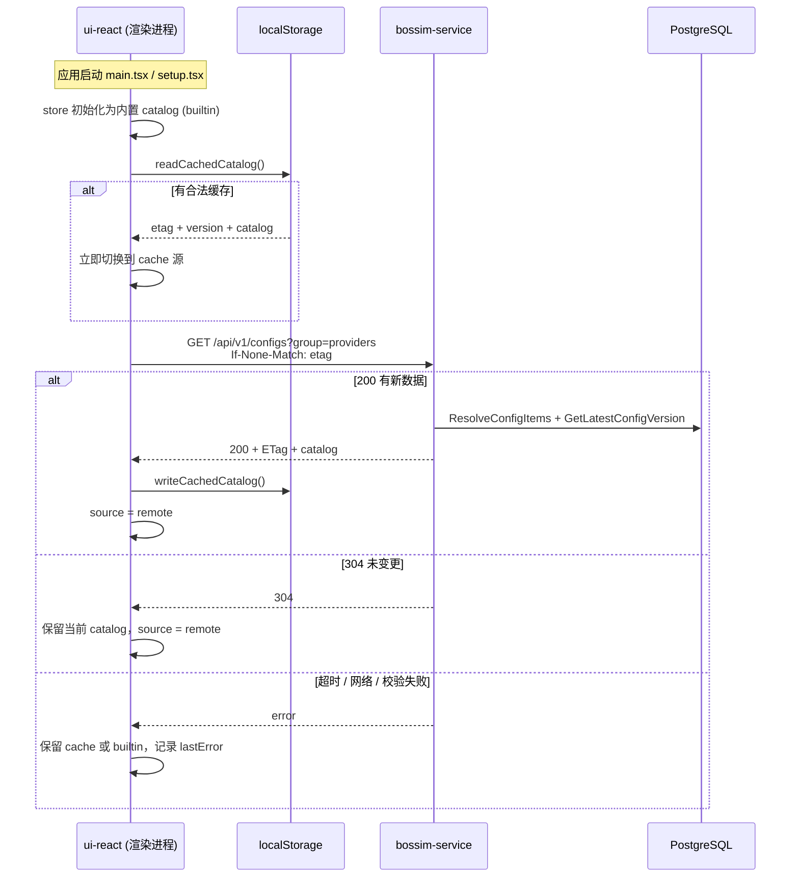

# Provider Catalog 动态下发方案

- 状态：已实现
- 日期：2026-06-17
- 服务：`bossim-service`（Go / Gin）
- 消费者：`ui-react`（Setup 向导、Settings Provider 配置）

## 概述

Bossim 桌面客户端的 **Provider 目录**（可选 LLM 厂商、认证方式、默认模型、可选模型列表、emoji 等）原先写死在 `ui-react/src/data/auth-choice-groups.ts`，每次增删 provider 都要发版。

当前方案改为由 **bossim-service 动态下发**，客户端在运行时拉取、校验、缓存，并在离线或失败时自动降级。**用户凭证（API Key、OAuth token）仍只存本地**，不下发、不上传。

本方案当前只覆盖 **provider catalog** 这一类配置（`group=providers`），不替代 OpenClaw Gateway 的 `openclaw.json` 运行时配置。

---

## 架构总览



### 核心模块

| 模块 | 路径 | 职责 |
|------|------|------|
| 类型与校验 | `ui-react/src/data/provider-catalog.types.ts` | Zod schema，网络边界校验 |
| 内置兜底 | `ui-react/src/data/auth-choice-groups.ts` | `BUILTIN_PROVIDER_CATALOG` 静态快照 |
| HTTP 客户端 | `ui-react/src/lib/provider-catalog/client.ts` | fetch、超时、ETag、解包 |
| 本地缓存 | `ui-react/src/lib/provider-catalog/cache.ts` | localStorage 读写 |
| 运行时 Store | `ui-react/src/store/provider-catalog.store.ts` | 唯一数据源，hooks + 查询函数 |
| 后端 API | `bossim-service` `GET /api/v1/configs` | 按 group/env/platform 解析配置 |
| 后端存储 | PostgreSQL `config_groups` / `config_items` / `config_versions` | 配置内容与版本号 |

---

## 1. 配置更新时机

客户端 **不会** 在每次打开 Provider 弹窗时重新拉取；更新发生在以下时机。

### 1.1 应用启动（自动）

入口在 `main.tsx` 与 `setup.tsx`：

```ts
void useProviderCatalogStore.getState().init();
```

`init()` 流程（仅首次执行）：

1. 将 `initialized` 置为 `true`，防止重复 init。
2. **同步** 从 localStorage 读取缓存；若校验通过，**立即**用缓存覆盖内置 catalog（用户无需等待网络）。
3. **异步** 调用 `refresh()`，向 bossim-service 后台拉取最新配置。

因此：**首屏即可用**（内置或缓存），网络结果返回后 UI 自动刷新（组件通过 `useProviderGroups` 等 hook 订阅 store）。

### 1.2 后台刷新（自动）

每次 `init()` 结束都会触发一次 `refresh()`。`refresh()` 默认携带当前 store 中的 `etag` 发条件请求：

- 服务端配置未变 → `304 Not Modified`，不替换 catalog，不写缓存。
- 服务端配置已变 → `200`，更新 store + localStorage。

当前 **没有** 定时轮询、没有 focus/visibility 自动刷新、没有 Gateway 重连触发刷新。

### 1.3 用户手动刷新

Settings → **Provider Configuration** 卡片右上角 **「Refresh providers」** 按钮：

```ts
useProviderCatalogStore.getState().refresh({ force: true });
```

`force: true` 会 **忽略本地 etag**，强制完整拉取。适用于：

- 后端刚改库并 bump 了 `config_versions`，但客户端仍显示旧列表；
- 怀疑 localStorage 与远端不一致；
- 调试联调。

### 1.4 不会触发更新的操作

| 操作 | 是否拉取 catalog |
|------|------------------|
| 修改本地 `openclaw.json` / Gateway 配置 | 否 |
| 保存 Provider API Key | 否 |
| 仅重启 Gateway | 否 |
| 打开 Setup / Settings 页面 | 否（除非刚好在启动后 refresh 进行中） |

Provider catalog 与 **运行时模型配置** 是两套数据：catalog 决定「能选什么」；`agents.defaults.model` 等决定「当前选了什么」。

---

## 2. 配置缓存机制

### 2.1 缓存位置与 Key

| 项 | 值 |
|----|-----|
| 存储 | `localStorage`（渲染进程） |
| Key | `bossim.provider-catalog.v1` |
| 作用域 | **每个 origin 独立**（Electron 与浏览器 `localhost:5174` 不共享） |

缓存结构：

```json
{
  "etag": "\"providers-5\"",
  "version": 5,
  "catalog": {
    "groups": [ /* ... */ ],
    "emoji": { /* ... */ },
    "modelCandidates": { /* ... */ }
  }
}
```

写入时机：**仅当** `fetchProviderCatalog` 返回 `status: "ok"`（HTTP 200 且 payload 通过 Zod 校验）。

读取时机：`init()` 第一步；校验失败则视为无缓存，继续用内置 catalog。

### 2.2 ETag 与 304 协商

服务端 ETag 格式（`config_handler.go`）：

```text
"{groupKey}-{version}"
```

示例：`"providers-5"`。

客户端在请求头携带：

```http
If-None-Match: "providers-5"
```

若 `config_versions` 中该 group 的 **最大 version 未变**，服务端返回 **304**，body 为空。此时：

- store 中的 `catalog` **不变**（继续用内存里已有的 cache/remote 数据）；
- `source` 标记为 `remote`；
- **不** 重写 localStorage。

**重要：** 若只 `UPDATE config_items` 改 JSON 内容，但 **没有** 向 `config_versions` 插入新版本，ETag 不变，已缓存的客户端可能长期收不到更新。运维改库后必须 **bump version**。

### 2.3 Store 中的 `source` 状态

| `source` | 含义 |
|----------|------|
| `builtin` | 使用 `BUILTIN_PROVIDER_CATALOG`，无有效缓存且尚未成功拉取 |
| `cache` | 来自 localStorage，远端尚未返回或 refresh 失败前的过渡态 |
| `remote` | 最近一次 refresh 成功（200 或 304） |
| `loading` | refresh 进行中 |

失败时回退规则（`refresh` 错误分支）：

- 若 `version > 0`（曾有过有效远端/缓存版本）→ 回退标记为 `cache`；
- 否则 → 保持 `builtin`。

### 2.4 清除缓存

开发调试：

1. Electron DevTools → Application → Local Storage → 删除 `bossim.provider-catalog.v1`；或
2. 代码调用 `clearCachedCatalog()`（`cache.ts`）；或
3. Settings 点 **Refresh providers**（`force: true` 可绕过 etag，但若 etag 未 bump 仍可能 304 拿到旧逻辑——改库后务必 bump version）。

---

## 3. 后端配置交互

### 3.1 请求

```http
GET /api/v1/configs?group=providers&platform=macos&env=dev&app_version=1.0.0
If-None-Match: "providers-4"
```

| 参数 | 必填 | 说明 |
|------|------|------|
| `group` | 是 | 固定为 `providers` |
| `platform` | 否 | `macos` / `windows` / `all`；客户端根据 Electron `platform` 映射：`darwin→macos`，`win32→windows`，否则 `all` |
| `env` | 否 | 省略时使用服务端 `app.env` 默认值（本地常为 `dev`，生产为 `prod`） |
| `app_version` | 否 | 客户端有则传；**MVP 阶段后端不按版本过滤**，字段仅透传预留 |

服务地址来自 `CONFIG.serviceBaseUrl`（`ui-react/src/data/config.ts`）：

- 环境变量 `VITE_BOSSIM_SERVICE_URL`（构建时注入）；
- 默认生产：`https://bossim-service-production.up.railway.app`。

**无需登录**：该接口为公开配置下发，不带 Bearer Token。

### 3.2 响应

成功（200）示例结构：

```json
{
  "code": 0,
  "message": "ok",
  "data": {
    "group": "providers",
    "version": 5,
    "items": {
      "catalog": {
        "groups": [ /* AuthProviderGroupDef[] */ ],
        "emoji": { "anthropic": "🟠" },
        "modelCandidates": {
          "deepseek": [
            "deepseek/deepseek-v4-flash",
            "deepseek/deepseek-v5-flash"
          ]
        }
      }
    }
  }
}
```

客户端只消费 `data.items.catalog`，并用 `providerCatalogSchema` 校验。`data.version` 与响应头 `ETag` 一并存入 store 与 localStorage。

### 3.3 超时与错误

| 项 | 值 |
|----|-----|
| 超时 | 4 秒（`AbortController`） |
| HTTP 非 2xx | 记 `lastError`，保留现有 catalog |
| `code !== 0` | 同上 |
| JSON 不符合 schema | `invalid catalog payload`，保留现有 catalog |

Electron 需在 CSP `connect-src` 中允许 service 域名（`apps/electron/src/main/window.ts` 读取 `BOSSIM_SERVICE_URL`）。

### 3.4 后端数据模型（简要）

| 表 | 作用 |
|----|------|
| `config_groups` | 配置组，如 `key = 'providers'` |
| `config_items` | 具体 JSON；`key = 'catalog'`；按 `env` + `platform` 分行（通常 `platform = 'all'`） |
| `config_versions` | 每次发布插入新 `version` + `snapshot`；**ETag 取自 MAX(version)** |

平台过滤 SQL 逻辑：`ci.platform = 'all' OR ci.platform = :platform`。

`min_app_version` / `max_app_version` 字段已存在，**当前 Resolve 查询未使用**，后续可扩展。

### 3.5 运维：修改配置后的标准流程

1. `UPDATE config_items` 修改 `value` JSON（`dev` / `prod` 按需同步）。
2. `INSERT INTO config_versions (...)` **version + 1**，snapshot 指向更新后的 catalog。
3. 用 curl 验证 version 与内容：

   ```bash
   curl -s "http://localhost:8080/api/v1/configs?group=providers&platform=macos&env=dev" \
     | jq '.data.version, .data.items.catalog.modelCandidates.deepseek'
   ```

4. 客户端清缓存或 **Refresh providers**。

---

## 4. 配置兜底能力

采用 **三层降级**，保证离线首启与网络故障时 Setup 仍可用。

```text
远端 (bossim-service)  →  localStorage 缓存  →  内置静态快照 (BUILTIN_PROVIDER_CATALOG)
```

### 4.1 第一层：内置静态（最终兜底）

- 来源：`auth-choice-groups.ts` 导出的 `BUILTIN_PROVIDER_CATALOG`。
- Store **初始状态**即为此数据，`source = builtin`，`version = 0`。
- 随应用发版更新；远端长期不可用时，用户看到的是 **上次打包时的 provider 列表**。
- **Logo 图片**始终来自客户端打包资源 `PROVIDER_LOGO`，**不在** catalog JSON 中下发。

### 4.2 第二层：localStorage 缓存

- 上一次 **成功 200** 的远端 catalog。
- 下次启动 `init()` 时 **同步加载**，在 refresh 完成前用户即可看到上次线上配置。
- 缓存损坏或 schema 校验失败 → 静默忽略，退回内置。

### 4.3 第三层：远端

- 成功时成为权威数据源，并回写缓存。
- 304 时认定远端与缓存一致，不重复解析 body。

### 4.4 失败时的用户体验

| 场景 | 用户看到 | 错误信息 |
|------|----------|----------|
| 首次安装 + 无网 | 内置 provider 列表 | `lastError` 有值，UI 一般不阻断 |
| 有缓存 + 无网 | 上次缓存列表 | 同上 |
| 有缓存 + 远端 200 | 最新列表 | 清除 |
| refresh 中 | 当前 catalog + 按钮 loading | — |

**不会** 因 catalog 拉取失败而清空已配置的 API Key 或 Gateway 配置。

---

## 5. Catalog 数据契约

### 5.1 `catalog` 字段

| 字段 | 类型 | 说明 |
|------|------|------|
| `groups` | `AuthProviderGroupDef[]` | Provider 列表；每项含 `id`、`label`、`methods[]` 等 |
| `emoji` | `Record<string, string>` | provider id → emoji |
| `modelCandidates` | `Record<string, string[]>` | provider id → 可选模型 id 列表（如 `deepseek/deepseek-v5-flash`） |

单个 auth method 常见字段：`id`、`label`、`type`（`api-key` / `oauth` / `custom` / `proxy`）、`envVar`、`consoleUrl`、`defaultModelId` 等。

### 5.2 模型下拉如何组成（Settings Step 3）

对某一 `providerId`，可选模型为以下并集（去重）：

1. 该 provider 所有 `methods[].defaultModelId`；
2. `modelCandidates[providerId]`；
3. （Settings 主页面额外）用户已在 `openclaw.json` 里配置过的 models。

因此：若要在 **现有 DeepSeek** 下增加 v5，应更新 **`modelCandidates.deepseek`**，而不是新建一个独立 provider group（除非产品上要拆成两个入口）。

### 5.3 刻意不下发的内容

| 内容 | 原因 |
|------|------|
| Provider Logo | 打包静态资源，按 id 映射 |
| API Key / OAuth 状态 | 用户隐私，仅存本地 |
| Gateway 完整配置 | 不属于 catalog 职责 |

---

## 6. 消费方（ui-react）

以下模块通过 `@/store/provider-catalog.store` 读取 catalog，**不再**直接 import 静态 `AUTH_PROVIDER_GROUPS` 做运行时查询：

- Setup：`ModelSelectionStep`、`ApiKeyStep`、`AllProvidersDialog`、`CompletionStep` 等
- Settings：`ProviderPicker`、`ProviderModelEditDialog`、`ProviderModelSection`、`ConfigPage`

推荐用法：

- 组件内：`useProviderGroups()`、`useFeaturedProviders()`、`useProviderCatalog()`
- 一次性查询：`findProviderGroup(id)`、`findAuthMethod(methodId)`、`modelCandidates(id)`、`providerEmoji(id)`
- 需要随 catalog 刷新重算 UI：订阅 `useProviderCatalogStore((s) => s.version)`

---

## 7. 本地开发与排障

### 7.1 环境变量

| 变量 | 作用 |
|------|------|
| `VITE_BOSSIM_SERVICE_URL` | 渲染进程 catalog fetch 目标 |
| `BOSSIM_SERVICE_URL` | Electron 主进程 CSP `connect-src` |

`apps/electron` 的 `dev` 脚本默认指向 `http://localhost:8080`。

### 7.2 常见问题

| 现象 | 可能原因 | 处理 |
|------|----------|------|
| 改库后 UI 不变 | 未 bump `config_versions` 或 304 | bump version + Refresh providers |
| DevTools 有数据但 Electron 没有 | localStorage 按 origin 隔离 | 在 Electron 内清缓存 |
| fetch 被拦截 | CSP 未包含 service 域名 | 检查 `window.ts` 与 `BOSSIM_SERVICE_URL` |
| 只有内置列表 | service 未启动 / URL 错误 / 超时 | 看 Network 与 `lastError` |
| 模型下拉只有一个 | 只配了 `defaultModelId`，未配 `modelCandidates` | 改 DB JSON 中 `modelCandidates` |

### 7.3 相关测试

```bash
pnpm test ui-react/src/lib/provider-catalog/client.test.ts
pnpm test ui-react/src/store/provider-catalog.store.test.ts
```

---

## 8. 与静态文件的关系

`auth-choice-groups.ts` 仍保留，原因：

1. 导出 `BUILTIN_PROVIDER_CATALOG` 作为最终兜底；
2. 导出 `PROVIDER_LOGO` 等客户端资源映射；
3. 类型定义与 CLI 侧概念对齐（注释中注明与 `auth-choice-options.ts` 同步）。

**新增 provider 的推荐流程：** 先改 bossim-service 数据库并 bump version → 客户端自动/手动刷新即可生效，**不必**等为发版。发版时仍建议同步更新内置兜底，保证离线体验与远端一致。

---

## 相关文档

| 文档 | 说明 |
|------|------|
| [auth/bossim-service-auth.md](./auth/bossim-service-auth.md) | 用户认证（与 catalog 无关，同为 bossim-service） |
| [dev/electron-local-dev.md](./dev/electron-local-dev.md) | Electron 本地开发与 CSP |
| [setup_wizard.md](./setup_wizard.md) | Setup 向导整体流程 |
